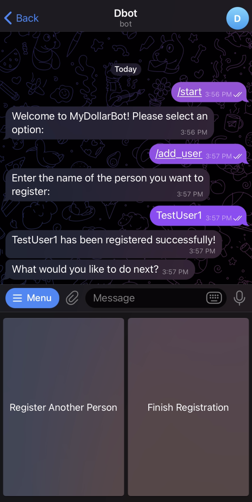

# About MyDollarBot's /add_user Feature
This feature enables the user to register fellow users to the expense tracker.

# Location of Code for this Feature
The code that implements this feature can be found [here](https://github.com/Fall-2023-SE-Group-14/DollarBot/blob/release-v2.0/code/add_user.py)

# Code Description
## Functions

1. register_people(message, bot):
This method takes in the new user details to register them to the tracker, then calls on the add_person method.

2. add_person(message, bot, registered_users, user_list):
This method checks if the new user already exists in the system, if not, then it adds that user to the main user_list. It presents the user with a choice of further adding more users or completing the registration process. Based on the user's choice, it calls the handle_registration_choice method.

3. handle_registration_choice(message, bot, registered_users, user_list)
This method updates the final json file with the newly added records and displays to the user a summary of all the registered users.

# How to run this feature?
Once the project is running(please follow the instructions given in the main README.md for this), please type /add_user into the telegram bot.

Below you can see an example:

