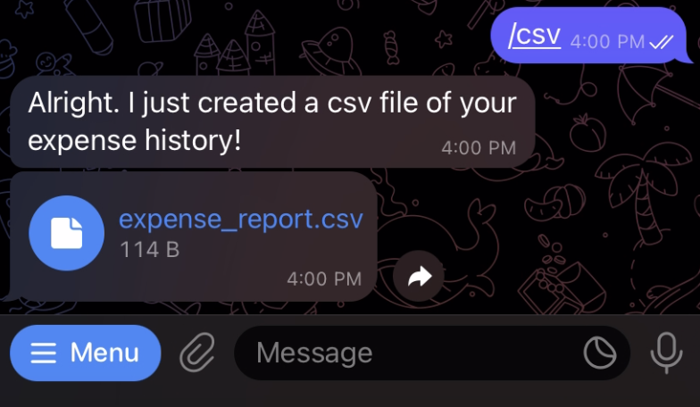
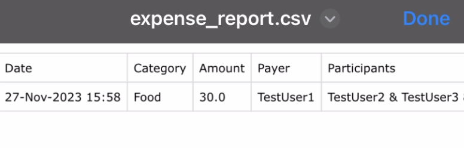

# About MyDollarBot's /csv Feature
This feature enables the user to get the expense report in csv format.

# Location of Code for this Feature
The code that implements this feature can be found [here](https://github.com/Fall-2023-SE-Group-14/DollarBot/blob/release-v2.0/code/csvfile.py)

# Code Description
## Functions

1. run(message, bot):
This is the main method which creates a csv file with the **date**, **category**, **amount**, **payer**, and **participants** details. It generates a csv file and sends it to the user in the chat.

# How to run this feature?
Once the project is running(please follow the instructions given in the main README.md for this), please type /csv into the telegram bot.

Below you can see an example:

Below is the csv file generated in the above example:

