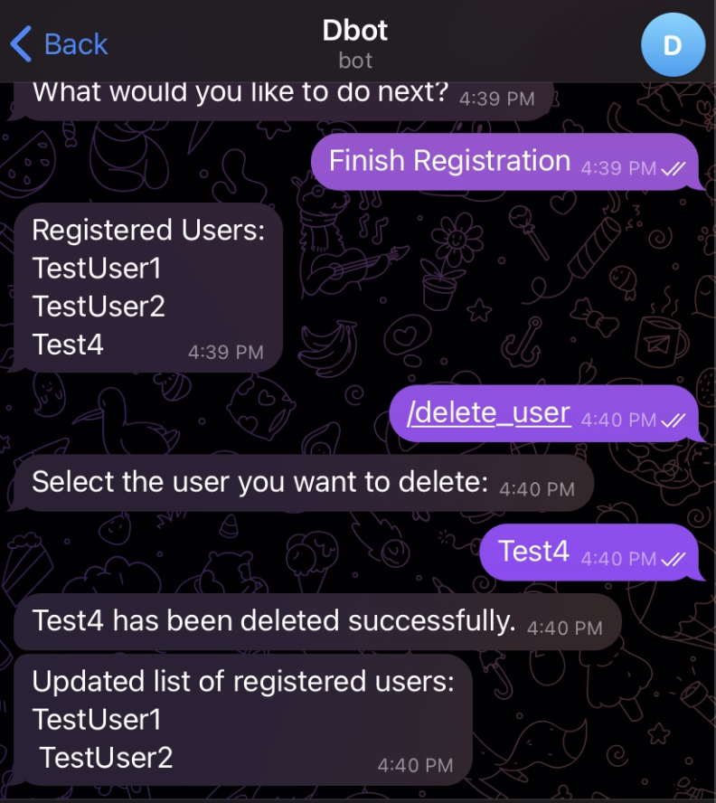

# About MyDollarBot's /delete_user Feature
This feature enables the user to delete a registered user from the tracker.

# Location of Code for this Feature
The code that implements this feature can be found [here]([https://github.com/Fall-2023-SE-Group-14/DollarBot/blob/release-v2.0/code/delete_user.py)

# Code Description
## Functions

1. delete_user(message, bot):
This method checks if there are any users left to be deleted. If yes, it displays all the registered users and takes the name of the person to be deleted from the chat. Then it invokes the confirm_delete method.

2. confirm_delete(message, bot, user_list):
This method removes the selected person from the user_list and displays the updated list of registered users. If there are no more registered users in the system, it displys an appropriate message.

# How to run this feature?
Once the project is running(please follow the instructions given in the main README.md for this), please type /delete_user into the telegram bot.

Below you can see an example:

