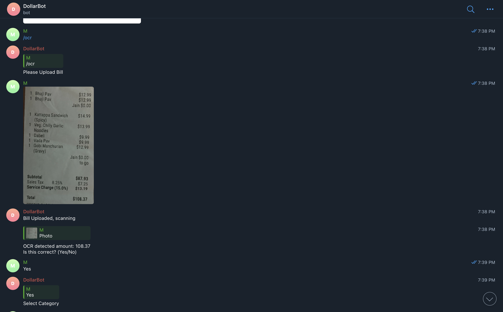
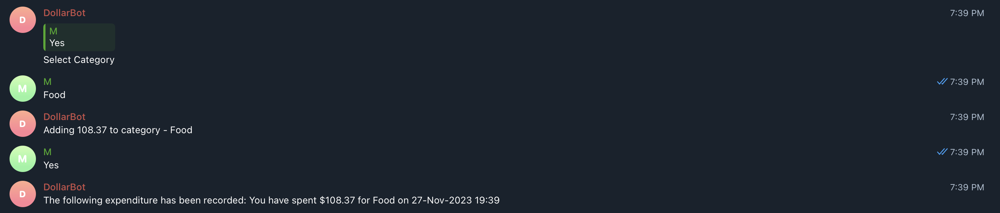

# About MyDollarBot's /ocr Feature
This feature enables the user to upload a picture of their bill and perform Optical Character Recognition to read the bill and add the expense to a category to their expense tracker.

# Location of Code for this Feature
The code that implements this feature can be found [here](https://github.com/Fall-2023-SE-Group-14/DollarBot/blob/main/code/ocr.py)

# Code Description
## Functions

1. run(message, bot):
This is the main function used to implement the ocr feature. It asks user to upload their bill.
It takes 2 arguments for processing - message which is the message from the user, and bot which is the telegram bot object from the main code.py function.

2. handle_invoive(message, bot):
It takes 2 arguments for processing - message which is the message from the user, and bot which is the telegram bot object from the run(message, bot): function in the ocr.py file. The handle_invoice function downloads the photo, performs OCR to extract text, specifically the total amount from the invoice. It calls functions ocr_invoice and extract_amount_from_text.

3. ocr_invoice(image_path):
It takes one argument, that is the path to uploaded image. The ocr_invoice function uses Tesseract OCR to extract text from the uploaded image.

4. extract_amount_from_text(text):
It takes one argument, that is the extracted text from the image. It uses regular expressions to process the text and returns the toal final amount of the bill. 

4. runOCR(message, bot):
It is used to add this expense to the expense tracker. It asks the user to choose the category, same as [add.py](https://github.com/Fall-2023-SE-Group-14/DollarBot/blob/main/code/add.py) and then proceeds to save this expense.

# How to run this feature?
Once the project is running(please follow the instructions given in the main README.md for this), please type /ocr into the telegram bot.

Below you can see an example in text format:

