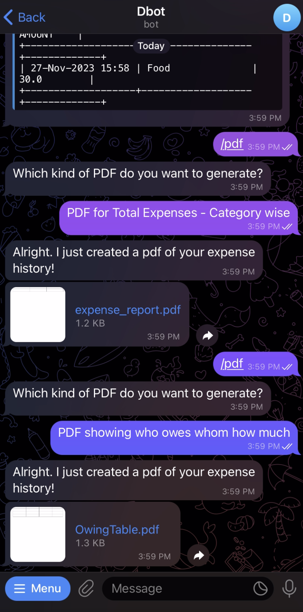
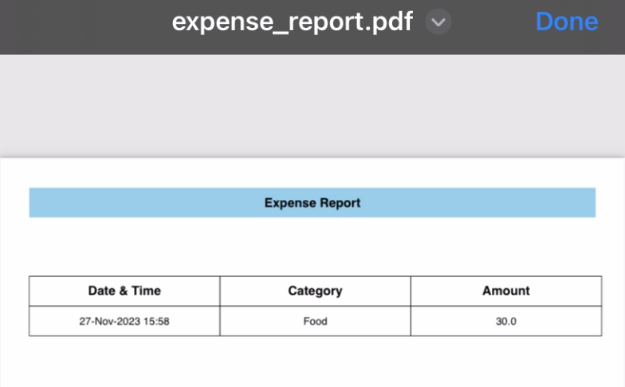
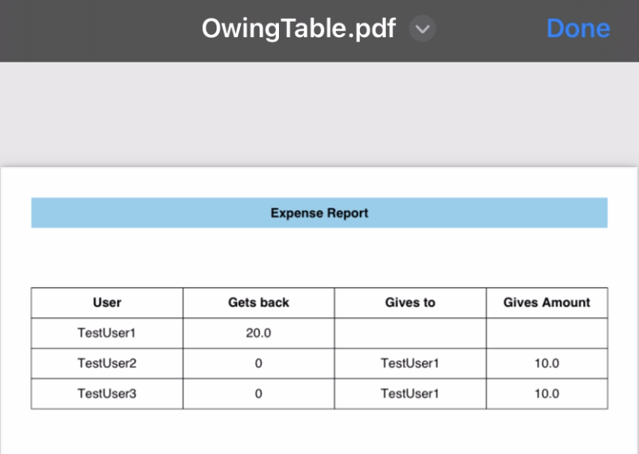

# About MyDollarBot's /pdf Feature
This feature enables the user to download the expense report in pdf format. It provides 2 options:\
1. Track the expenses in the group
2. Track who owes how much to whom in the group

# Location of Code for this Feature
The code that implements this feature can be found [here](https://github.com/Fall-2023-SE-Group-14/DollarBot/blob/release-v2.0/code/add_user.py)

# Code Description
## Functions

1. run(message, bot):
This is the main method which presents the user with the 2 options mentioned above. On receiving the user's choice, it invokes the pdfGeneration method.

2. pdfGeneration(message, bot, user_list, user_history):
This method tabulates the data according to the user's choice and generates a pdf file which is then sent to the user in the chat.

# How to run this feature?
Once the project is running(please follow the instructions given in the main README.md for this), please type /pdf into the telegram bot.

Below you can see an example:

Below is the sample pdf for option 1:

Below is the sample pdf for option 2:

