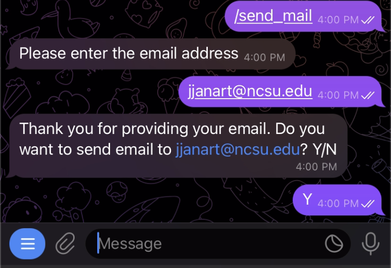
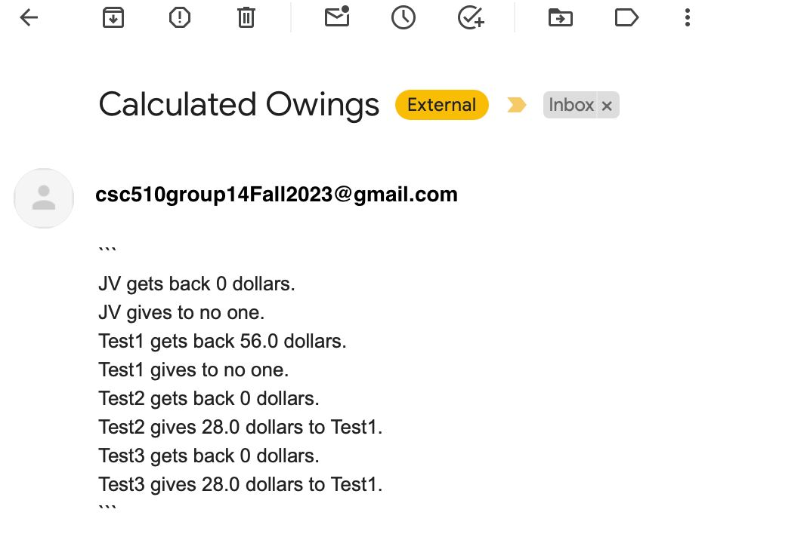

# About MyDollarBot's /send_mail Feature
This feature enables the user to receive an email with the summary of the expenses recorded in the tracker.

# Location of Code for this Feature
The code that implements this feature can be found [here](https://github.com/Fall-2023-SE-Group-14/DollarBot/blob/updated_doco/code/send_mail.py)

# Code Description
## Functions

1. run(message, bot):
This is the main method which fetches the email address from the user. It invokes the add_emails method by passing the received email address.

2. add_emails(message, bot):
This method invokes the is_valid_email method to verify the entered email address. On checking that it is valid, this method will receive confirmation from the user to send the email, and then invoke the send_email method.

3. is_valid_email(email):
This method checks if the entered email address is in a valid format using regular expressions.

4. send_email(choice, bot):
This method creates an **smtp server** and establishes a TLS connection on **port 587** and sends an email using **csc510group32@gmail.com**. It invokes the format_text_data method to create the contents of the email.

5. format_text_data(user_list):
This method populates the contents of the email being sent. It adds the values for the following fields **for each registered user**:\
**gets back** \
**gives to**

# How to run this feature?
Once the project is running(please follow the instructions given in the main README.md for this), please type /send_mail into the telegram bot.

Below you can see an example:

Below is the sample email generated in the above example:

